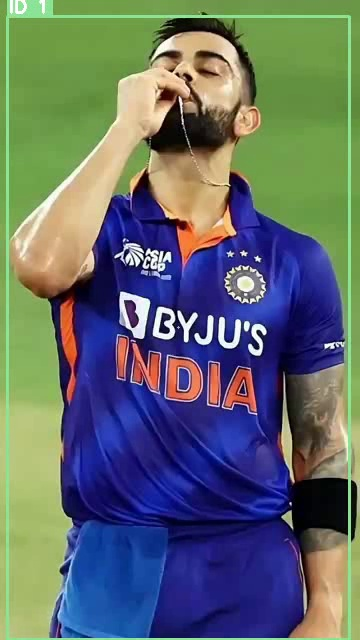
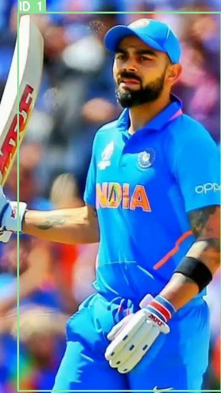
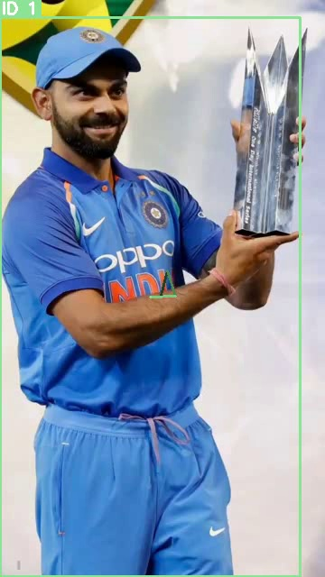

# Sports Multi-Object Tracking

> Real-time player detection and persistent ID tracking in cricket footage.
> Built with YOLOv8 + ByteTrack + OpenCV + Gradio

---

## What This Project Does

This project automatically detects all players in a cricket video and assigns each player a unique persistent ID that stays consistent throughout the entire video - even when players move fast, overlap, or go out of frame briefly.

---

## How It Works - Step by Step

### Step 1 - Video Input
- Takes any cricket or sports video as input
- Reads it frame by frame using OpenCV
- Processes every 2 frames for efficiency on CPU

### Step 2 - Player Detection using YOLOv8
- YOLOv8n model detects all people in each frame
- Draws a bounding box around each detected player
- Only keeps detections with confidence above 35 percent
- Runs entirely on CPU - no GPU needed

### Step 3 - ID Assignment using ByteTrack
- ByteTrack assigns a unique ID to each detected player
- ID 1, ID 2, ID 3 - each player gets their own number
- Uses IoU (Intersection over Union) matching to track same player across frames
- Two-stage matching keeps IDs alive during brief occlusion

### Step 4 - Frame Annotation using OpenCV
- Draws colored bounding box around each player
- Each player gets their own unique color that never changes
- Shows ID number above each bounding box
- Draws movement trail showing where player came from

### Step 5 - Output Video
- All annotated frames saved back as MP4 video
- You can clearly see each player with their persistent ID

---

## Why YOLOv8 + ByteTrack?

- YOLOv8 is the fastest and most accurate real-time object detector available
- ByteTrack does not need a separate Re-ID model - making it lightweight
- Together they work efficiently on CPU with 8GB RAM
- ByteTrack handles occlusion using two-stage IoU Hungarian matching
- Same player always gets same color via seeded random color from ID

---

## Tech Stack

- Detector : YOLOv8n (Ultralytics 8.4.0)
- Tracker : ByteTrack (Supervision 0.27.0)
- Annotation : OpenCV 4.13
- Web App : Gradio (Hugging Face Spaces)
- Language : Python 3.11

---

## Project Structure

- src/detector.py - YOLOv8 person detection wrapper
- src/tracker.py - ByteTrack multi-object tracker
- src/annotator.py - Bounding boxes, ID labels, trails
- pipeline.py - Main runner script
- app.py - Gradio web app deployed on Hugging Face
- report/ - Technical report

---

## Results

- Video resolution: 360x640 portrait cricket footage
- Total frames processed: 72
- FPS: 6.0
- Persistent player IDs maintained throughout video
- Colored bounding boxes and trajectory trails per player

---

## Live Demo

Try the live demo on Hugging Face Spaces:
https://huggingface.co/spaces/nidhi01bhagat/sports-object-tracking

## Video Source

Original cricket video: https://www.youtube.com/shorts/Cdcmx576dtY

---

## Setup

### Install
pip install -r requirements.txt

### Download video
py -3.11 -m yt_dlp https://www.youtube.com/shorts/Cdcmx576dtY -o input_video.mp4

### Run tracker
py -3.11 pipeline.py

### Run web app locally
py -3.11 app.py

---

## Author

Nidhi Bhagat
- GitHub: github.com/nidhi01bhagat
- LinkedIn: linkedin.com/in/nidhi-bhagat01
